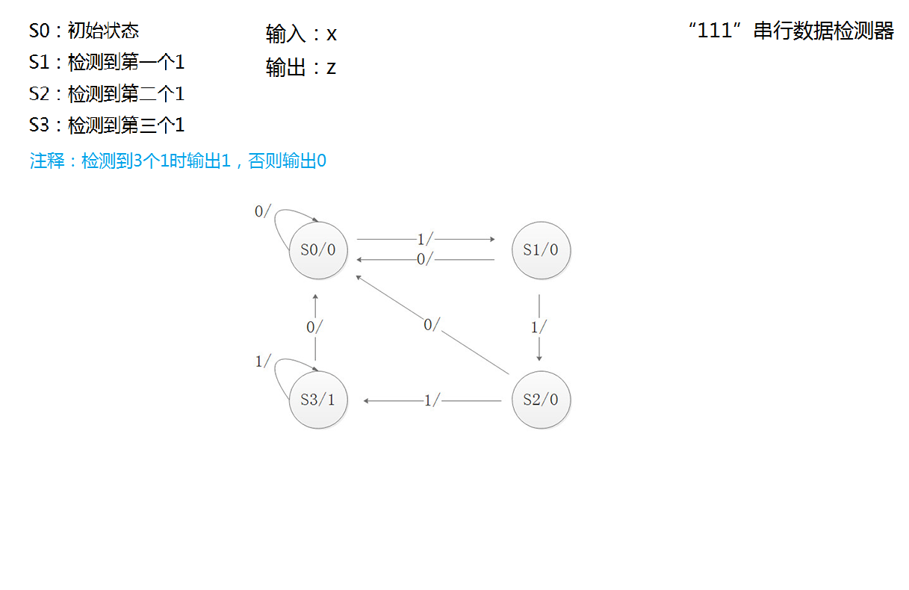
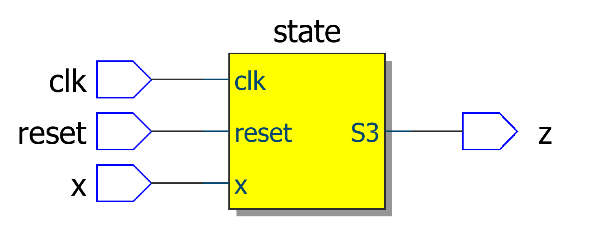

# 111序列检测器

## 1.设计思路

## 2.源代码 

    /************101序列检测器********************
    clk => 时钟信号
    reset => 同步清零
    x => 输去信号
    z => 输出信号
    1.采用格雷编码方式（常用的有四种：顺序编码、格雷编码、热码编码、约翰逊编码）
    2.采用三段式的描述方式
    ********************************************/
    
    module fsm_seg111_d3 (z,clk,reset,x);
    
    input wire clk,reset,x;
    output reg z;
    
    localparam S0 = 2'b00,
               S1 = 2'b01,
               S2 = 2'b11,
               S3 = 2'b10;
    
    reg [1:0] state,next_state;
    			  
    always@(posedge clk,posedge reset) begin    //现态
    if(reset == 1) state <= S0;
    else state <= next_state;
    end
    
    always@(state,x) begin    //次态
    case(state)
    S0: begin if(x == 0) next_state <= S0;
        else next_state <= S1; end 
    S1: begin if(x == 0) next_state <= S0;
        else next_state <= S2; end 
    S2: begin if(x == 0) next_state <= S0;
        else next_state <=S3; end 
    S3: begin if(x == 0) next_state <= S0;
        else next_state <= S3; end 
    default: next_state <= S0;
    endcase
    end
    
    always@(state) begin    //输出
    case(state)
    S3: z=1;
    default: z=0;
    endcase
    end
    
    endmodule
    
## 3.综合后的RTL图

## 4.综合后的状态转换图

